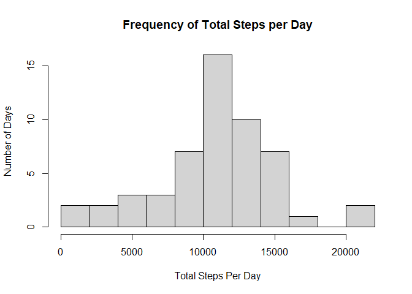
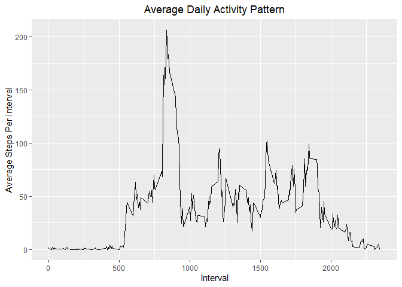
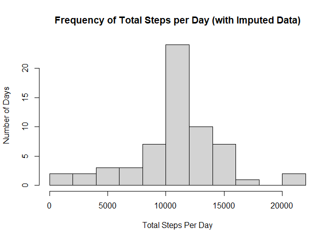
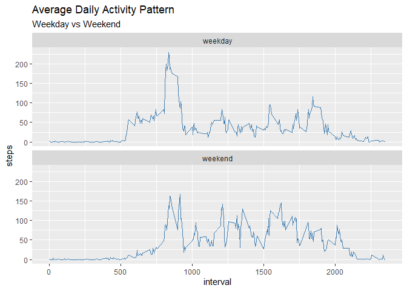

**This document contains the completed course Project 1 assignment for the Johns Hopkins Reproducible Research Coursera course.**

## Loading and preprocessing the data

We will be using  a few additional libraries to process this data
Loading them here:


```r
## load dplyr library we will use
library(dplyr)
## load lubridate  library we will use
library(lubridate)
## load ggplot2  library we will use
library(ggplot2)
```


The data file for this assignment comes in a zipped file called **_activity.zip_**.
This file contains *__activity.csv_**
*To load this data we will unzip **_activity.csv_** into the working directory.

```r
data_file <- "activity.csv"  ##set name of data file
if (!file.exists(data_file)) {
        ## check OS
        is_windows <- .Platform$OS.type == "windows"  ##if running on Windows set flag
        ## download the dataset
        ## dataset should be downloaded as part of fork of Github repository - but direct link
        ## is included here in case file doesn't exist.
        download.file(url = "https://d396qusza40orc.cloudfront.net/repdata/data/activity.zip", 
                      destfile = "activity.zip",
                      method = ifelse(is_windows, "auto", "curl"))
        ## unzip the dataset archive
        unzip(zipfile = "activity.zip", files = data_file)
        ## now we should have the csv file 'activity.csv'
}
```
1. Load the data (i.e. read.csv())

Now that we have the CSV data we will read that into our raw data object and take 
a quick look

```r
##read data into csvdata
csvdata <- read.csv(file = data_file, colClasses = c("integer","Date","numeric"))
##take a look at first few rows of data and last few rows of data
str(csvdata)
```

```
## 'data.frame':	17568 obs. of  3 variables:
##  $ steps   : int  NA NA NA NA NA NA NA NA NA NA ...
##  $ date    : Date, format: "2012-10-01" "2012-10-01" ...
##  $ interval: num  0 5 10 15 20 25 30 35 40 45 ...
```

```r
head(csvdata)
```

```
##   steps       date interval
## 1    NA 2012-10-01        0
## 2    NA 2012-10-01        5
## 3    NA 2012-10-01       10
## 4    NA 2012-10-01       15
## 5    NA 2012-10-01       20
## 6    NA 2012-10-01       25
```

```r
tail(csvdata)
```

```
##       steps       date interval
## 17563    NA 2012-11-30     2330
## 17564    NA 2012-11-30     2335
## 17565    NA 2012-11-30     2340
## 17566    NA 2012-11-30     2345
## 17567    NA 2012-11-30     2350
## 17568    NA 2012-11-30     2355
```
A few things to notice about the data:

* The **steps** column may contain **NA** values
* The **date** column is in the format *"YYYY-MM-DD"*
* The **interval** column starts at 0 for each day and ends in 2355 before next day
    + This is equivalent to HHMM (hour:minute) of the day

2. Process/transform the data (if necessary) into a format suitable for your analysis

We will need to convert this interval to an actual time. 
We will do this by creating a new **activity** data frame from the original CSV
that will add a *date_time* column

```r
activity<-mutate(csvdata,date_time=parse_date_time(paste(csvdata$date,format(strptime(sprintf("%04d", csvdata$interval),format="%H%M"),format = "%H:%M")), orders = "ymd HM"))
head(activity)
```

```
##   steps       date interval           date_time
## 1    NA 2012-10-01        0 2012-10-01 00:00:00
## 2    NA 2012-10-01        5 2012-10-01 00:05:00
## 3    NA 2012-10-01       10 2012-10-01 00:10:00
## 4    NA 2012-10-01       15 2012-10-01 00:15:00
## 5    NA 2012-10-01       20 2012-10-01 00:20:00
## 6    NA 2012-10-01       25 2012-10-01 00:25:00
```

```r
class(activity$date_time)
```

```
## [1] "POSIXct" "POSIXt"
```
As shown above - this give us a *date_time* column of class *POSIXct*

## What is mean total number of steps taken per day?
Now we can process a few simple statistics from the data

1. Make a histogram of the total number of steps taken each day
We will first get a **stepsByDate** grouping by date using group_by and summarize functions.
Also we will use the na.omit to remove the **NA** values

```r
stepsByDate <- activity %>% na.omit %>% group_by(date) %>% summarize(steps=sum(steps))
```
Now using this data we can create the histogram

```r
hist(stepsByDate$steps, xlab = "Total Steps Per Day", ylab = "Number of Days", breaks = 10,
     main = "Frequency of Total Steps per Day")
```

<!-- -->

2. Calculate and report the **mean** and **median** total number of steps taken per day
Using the same **stepsByDate** data frame, we can calculate the mean and median

```r
meanSteps <- format(mean(stepsByDate$steps), nsmall = 0) ## use format to round
medianSteps <- format(median(stepsByDate$steps), nsmall = 0) ## use format to round
```
* The **mean** total number of steps taken per day is 
    10766.19 steps.
* The **median** total number of steps taken per day is 
    10765 steps.

## What is the average daily activity pattern?
To answer this we will:

1. Make a time series plot of the 5-minute interval (x-axis) and the average number
of steps taken, averaged across all days (y-axis)


```r
stepsByInterval<-summarize(group_by(activity,interval),steps=mean(steps,na.rm=TRUE))
g<-ggplot(data=stepsByInterval, aes(x=interval,y=steps))+geom_line()
g+ggtitle("Average Daily Activity Pattern")+theme(plot.title = element_text(hjust = 0.5))+xlab("Interval")+ylab("Average Steps Per Interval")
```

<!-- -->

2. Find the 5-minute interval, on average across all the days in the dataset that 
contains the maximum number of steps.


```r
maxStepsInterval<-stepsByInterval[which.max(stepsByInterval$steps),]$interval
maxStepsDuringMaxInterval<-stepsByInterval[which.max(stepsByInterval$steps),]$steps
maxStepsMinute<-minute(strptime(sprintf("%04d", maxStepsInterval),format="%H%M"))
maxStepsHour<-hour(strptime(sprintf("%04d", maxStepsInterval),format="%H%M"))
```
The 5-minute interval at **8:35** contains the maximum number of steps **(206.1698113)** on average across all the days in the dataset.


## Imputing missing values
As mentioned before the steps column may contain **NA** values and this may introduce
bias into some of the calculations.

1. Calculate and report the total number of missing values in the dataset (i.e. the total number of rows with NAs)

The total number of missing values in the dataset are first calculated.

```r
missingStepsData<-sum(is.na(activity$steps))
```
There are **2304** NA values in the **steps** column of the dataset.

2. Devise a strategy for filling in all of the missing values in the dataset. The strategy does not need to be sophisticated. For example, you could use the mean/median for that day, or the mean for that 5-minute interval, etc.
3. Create a new dataset that is equal to the original dataset but with the missing data filled in.

We will use the mean for the 5-minute intervals across days where the data is not missing to 
impute values for these NA data points. This will create a new dataset - **activityImputed**

```r
## Use the merge fuction to combine average from 'stepsByInterval' with 'activity' data frames
activityImputed<-merge(activity, stepsByInterval, by = "interval", sort=FALSE)
## Sort on date and interval to reorder
activityImputed <- activityImputed[with(activityImputed, order(date,interval)), ] 
## now we will replace the NA values in this data frame with  value from the 'stepsByInterval.steps' column
activityImputed$steps.x[is.na(activityImputed$steps.x)] <- activityImputed$steps.y[is.na(activityImputed$steps.x)]
## round the steps to whole number
activityImputed$steps <- round(activityImputed$steps.x, digits = 0)
```
4. Make a histogram of the total number of steps taken each day and calculate and report the **mean** and **median** total number of steps taken per day. Do these values differ from the estimates from the first part of the assignment? What is the impact of imputing missing data on the estimates of the total daily number of steps?

We will first get a **stepsByDateImputed** grouping by date and using summarize function with the new dataset

```r
stepsByDateImputed <- activityImputed %>% na.omit %>% group_by(date) %>% summarize(steps.x=sum(steps.x))
```
Now using this data we can create the new histogram with this data

```r
hist(stepsByDateImputed$steps.x, xlab = "Total Steps Per Day", ylab = "Number of Days", breaks = 10,
     main = "Frequency of Total Steps per Day (with Imputed Data)")
```

<!-- -->

And finally we will recalculate the mean and the median with the new data

```r
meanStepsImputed <- format(mean(stepsByDateImputed$steps.x), nsmall = 0)
medianStepsImputed <- format(median(stepsByDateImputed$steps.x), nsmall = 0)
```

* The **mean** total number of steps taken per day is 
    **10766.19** steps.
* The **median** total number of steps taken per day is 
    **10766.19** steps.

The mean and median are very close to the original data before imputing missing values. There may be a better way to impute the missing values, but this is a reasonable estimate for a simple exercise and does not skew the data significantly. This histogram shows an increase in frequency but the basic shape is the same.

## Are there differences in activity patterns between weekdays and weekends?
We will now divide the data into weekdays versus weekends to see if there are differences in these patterns.

1. Create a new factor variable in the dataset with two levels – “weekday” and “weekend” indicating whether a given date is a weekday or weekend day.

```r
activityImputed$dayofweek<-factor(weekdays(activityImputed$date))
levels(activityImputed$dayofweek) <- list("weekday" = c("Monday", "Tuesday", "Wednesday", "Thursday", "Friday"), "weekend" = c("Saturday", "Sunday"))
```

2. Make a panel plot containing a time series plot of the 5-minute interval (x-axis) and the average number of steps taken, averaged across all weekday days or weekend days (y-axis). See the README file in the GitHub repository to see an example of what this plot should look like using simulated data.


```r
stepsByIntervalWeekday<-summarize(group_by(activityImputed,interval,dayofweek),steps=mean(steps.x))

g<-ggplot(stepsByIntervalWeekday,aes(interval, steps))+geom_line(color="steelblue")+facet_wrap(~dayofweek, dir="v")
g+labs(title="Average Daily Activity Pattern",subtitle = "Weekday vs Weekend")
```

<!-- -->

REFERENCE for GGPLOT : http://zevross.com/blog/2019/04/02/easy-multi-panel-plots-in-r-using-facet_wrap-and-facet_grid-from-ggplot2/
